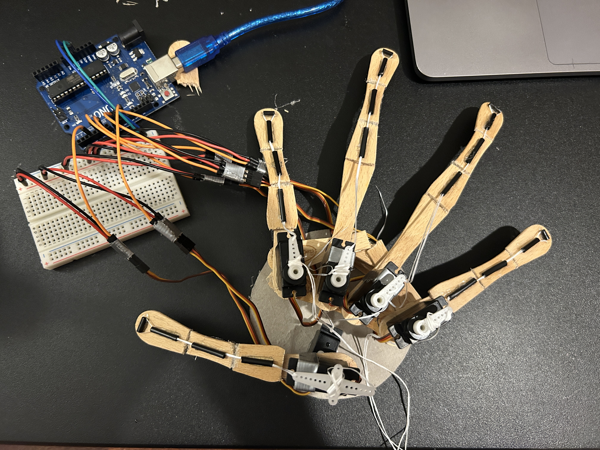

# robot-hand

software: 
- Python 3.12.7
- Arduino: 2.3.4

hardware:
- Arduino Uno
- 6 MG90S 9g servos
- popsicle sticks, straws, floss, hotglue, duct tape (not necessary)

reproducing:
1. `pip install -r requirements.txt`
2. flash the Arduino script onto hardware
3. run Python script
4. control hand!
